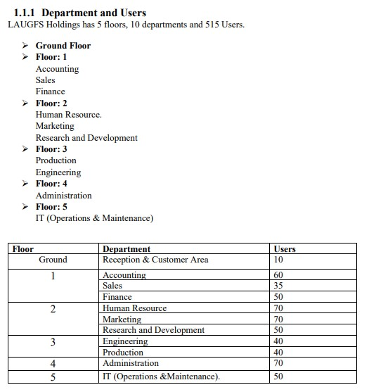
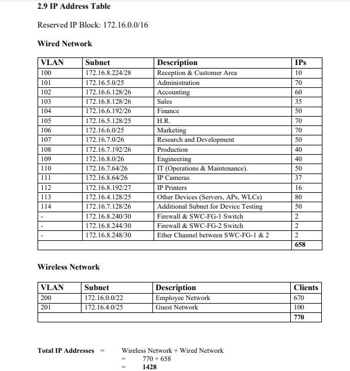

# Designed and Implemented Network

I involved in the 1st year Final Project of my Degree Program, have designed and Implemented a Network Solution for a Virtual Company named Laugf. Which was well-documented and had the above table of contents. Which was rewarded with A making 4.0 GPA.

## Organizational Layout
LAUFGFS Holding is medium-sized company located in Sri Lanka, with approximately 550 staff members. LAUGFS Holdings Limited is a diversified conglomerate from Sri Lanka and has
since expanded overseas. LAUGFS Holdings is mainly engaged in Energy, retail, Industrial and manufacturing, Hospitality, Real estate, logistics, pharmaceuticals and several other sectors.

## [Contents](./Contents/Contents.pdf)
2. Design of Solution
 - 2.1 Network Analysis
 - 2.2 [Physical & Logical Network Topologies](Contents)
 - 2.3 [Floor Diagram](Diagrams)
 - 2.4 [Cabling Diagram](Diagrams)
 - 2.5 [Access Point Diagram](Diagrams)
 - 2.6 Server Rack Diagram (36U)
 - 2.7 Server Room Specifications
 - 2.8 [VLAN Table](Networking)
 - 2.9 [IP Address Table](Networking)
 - 2.10 [Switch Port Calculation Table](Networking)
 - 2.11 [Port Assignment Table](Networking)
 - 2.12 [Protocols Used in the Network](Networking)
 - 2.13 ISP Connections
 - 2.14 Bandwidth Calculation
 - 2.15 Limit Bandwidth in Switch Ports
3. Implementation
 - 3.1 Install & Configure the Server
 - 3.2 Implementing AD DS server 
 - 3.2.1 Implementing Group Policies
 - 3.3 Implementing a DHCP server
 - 3.4 Implementing Network Monitoring (SNMP) 
 - 3.5 Implementing Syslog Server
 - 3.6 Implementing Firewall (Sophos XG 550 Rev.2)
 - 3.7 Implementing AAA Server (Cisco ACS)
4. Evaluation
5. Conclusion
6. [Appendices](Devices)
7. References

## More information

Summary

- To start up from the scratch, I used Microsoft Visio for the Interior plans and floor, cabling, cctv diagrams.
- Used GNS3 to represent a virtual scenario.
- Implemented Using Real Devices, which was produced by my College.
- Tools I took for virtually n real devices.

*for the lan*  
-   Layer 2 Switch
-   Layer 3 Switch
-   Access Point
-   Desktop Computers

*for the Security*  
-   Sophos XG

*for the servers*  
-   Windows Server 2016

*for the simple virtualization*  
-   VMware ESXI

## Diagrams
 - Topology :-
 
 - [Physical Topology](./Contents/PhysicalTopology.pdf)
 - [Logical Topology](./Contents/LogicalTopology.pdf)
 
 
 - Organizational Layout

 - Ip Address

  

- Server Rack Diagram (36U)
 
 
 
 - Virtually Using GNS3

 
